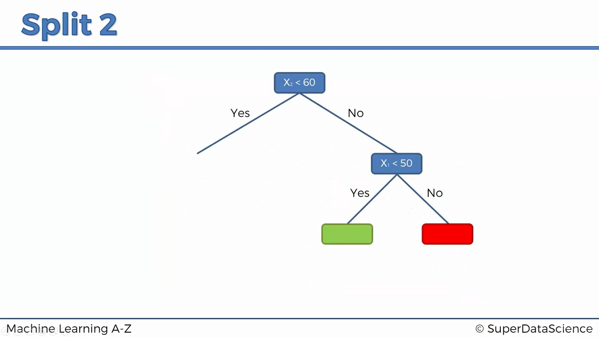
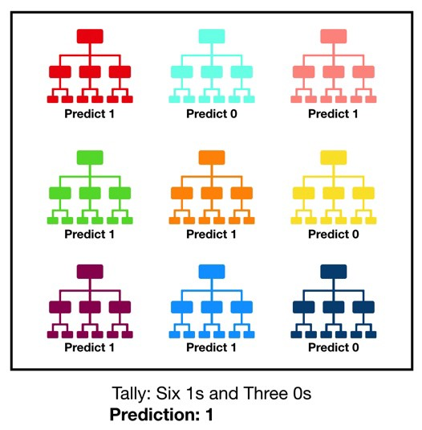

# ML Classifications
Prepared by Mahmoud Ahmedy, 3rd year CSE undergrad at FEE, Menoufia University
## Table of Content
- [Decision Tree](#decision-tree-classification)
	- [Entropy](#entropy)
	- [Pros and Cons](#pros-and-cons)
	- [Example](#example)
		- [Intuition](#intuition)
		- [Splits](#splits)
	- [Code](./algorithms/decision_tree)
- [Random Forest](#random-forest-classification)
	- [Ensemble Learning](#ensemble-learning)
	- [Pros and Cons](#pros-and-cons-1)
	- [Code](./algorithms/random_forest)

## Decision Tree Classification
Decision tree builds classification models in the form of a tree structure. It breaks down a dataset into smaller and smaller subsets while at the same time an associated decision tree is incrementally developed. The final result is a tree with **decision nodes** and **leaf nodes**. A decision node has two or more branches. Leaf node represents a classification or decision. The topmost decision node in a tree which corresponds to the best predictor called **root node**. Decision trees can handle both categorical and numerical data.

### Entropy
A decision tree is built top-down from a root node and involves partitioning the data into subsets that contain instances with similar values (homogenous). ID3 algorithm uses entropy to calculate the homogeneity of a sample. If the sample is completely homogeneous the entropy is zero and if the sample is an equally divided it has entropy of one.
### Pros and Cons
-   Pros
    -   Easy to interpret visually when the trees only contain several levels
    -   Can easily handle qualitative (categorical) features
    -   Works well with decision boundaries parallel to the feature axis
-   Cons
    -   Prone to overfitting
    -   Possible issues with diagonal decision boundaries

### Example
Courtesy of SuperDataScience © and Machine Learning A-Z ™ course.
#### Intuition

#### Splits
##### Split 1

##### Split 2

##### Split 3

##### Split 4

## Random Forest Classification
Random forest, like its name implies, consists of a large number of individual decision trees that operate as an [ensemble](https://en.wikipedia.org/wiki/Ensemble_learning). Each individual tree in the random forest spits out a class prediction and the class with the most votes becomes our model’s prediction.

### Ensemble Learning
**Ensemble methods** use multiple learning algorithms to obtain better predictive performance than could be obtained from any of the constituent learning algorithms alone.
### Pros and Cons
-   Pros
    -   Decorrelates trees (relative to bagged trees)
        -   important when dealing with multiple features which may be correlated
    -   Reduced variance (relative to regular trees)
-   Cons
    -   Not as easy to visually interpret

### Example
#### Intuition
1. Step 1: Pick at random K data points from the Training set.
2. Build the Decision Tree associated to these K data points.
3. Choose the number if Ntree of trees you want to build and repeat steps 1 & 2
4. For a new data point, make each one of your Ntree trees predict the category to which the data points belongs, and assign the new data point to the category that wins the majority vote.